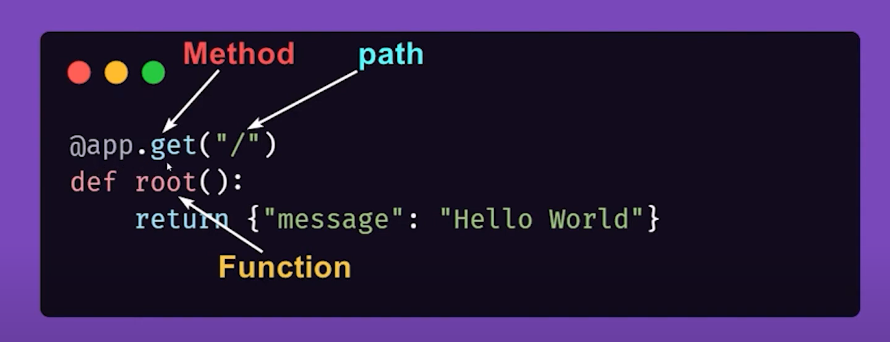

# FastAPI Learning.
A hands-on guide to mastering FastAPI, the high-performance Python framework for building APIs. This repository covers core concepts, CRUD operations, authentication, testing, and deployment on platforms like Docker and AWS. Ideal for all skill levels, it includes practical examples to accelerate learning. Contributions welcome!
### 👨‍💻 How to run
```bash
conda create -n fast_api python=3.12 -y
```

```bash
conda activate fast_api
```

```bash
pip install "fastapi[standard]"
```

```bash
pip freeze    //Check Insatlled package list
```
```bash
fastapi dev main.py
```

## Path Operation
